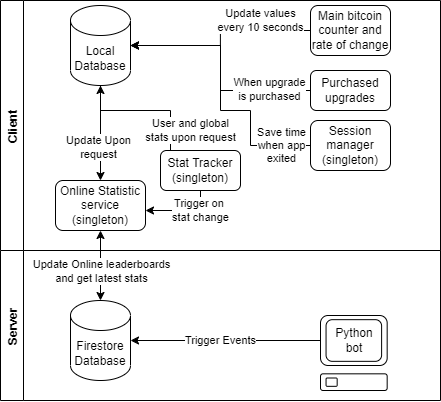
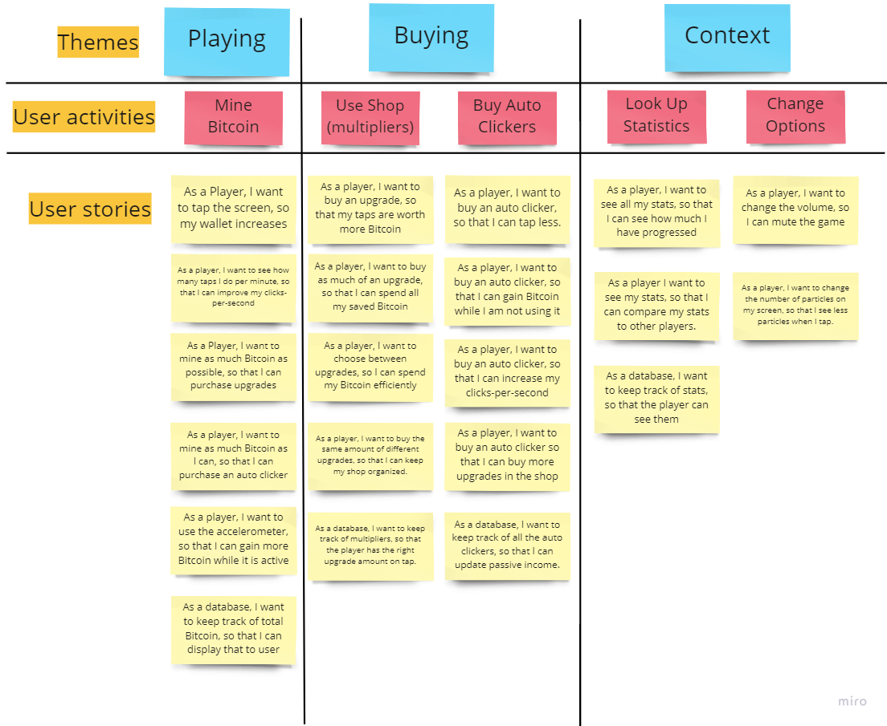
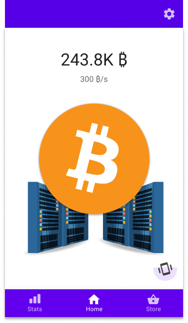
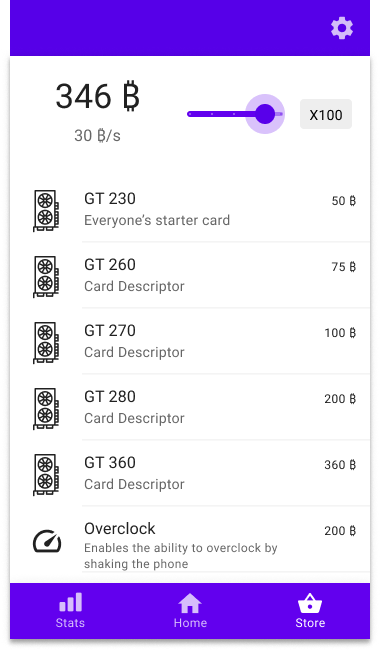
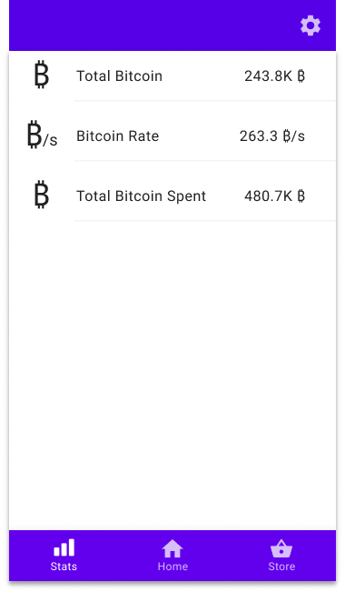
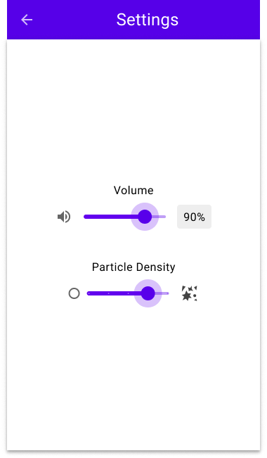
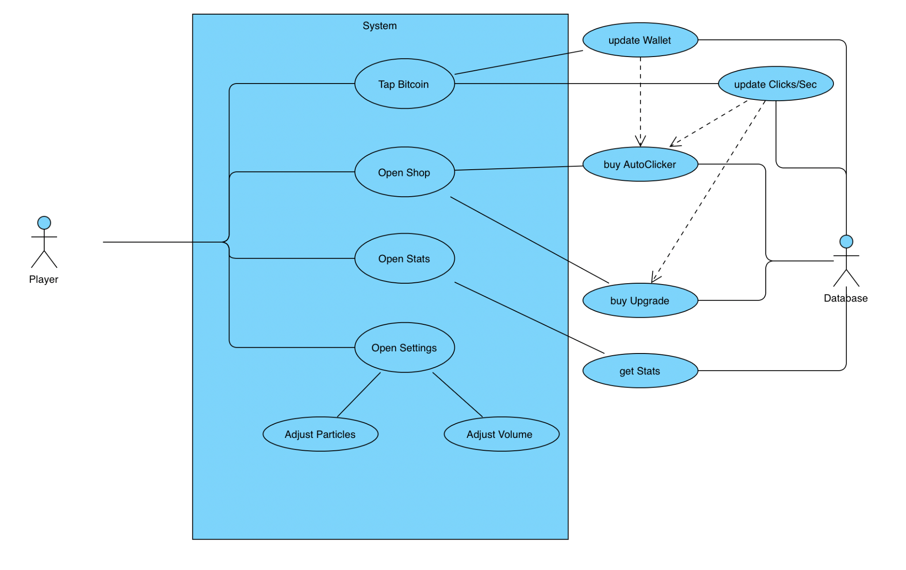

**Bitcoin Blitz**

**Final Report**

10.13.2022

**─**

Cameron Jacobson & Kenneth Nguyen

Small Indie Company

WPI CS4518-A22

Prof. Guo

# **Table of contents**

[**Table of contents**](#table-of-contents) **2**

[**Introduction**](#introduction) **3**

[System Architecture](#system-architecture) 3

[**User Stories**](#user-stories) **4**

[**Functional Requirements**](#functional-requirements) **5**

[UI Mockup](#ui-mockup) 5

[Use Case Diagram](#use-case-diagram) 7

[Scenarios](#scenarios) 7

[**Non-functional Requirements**](#non-functional-requirements) **8**

[Performance](#performance) 8

[Privacy and Security](#privacy-and-security) 9

[Changes Made](#changes-made) 9

[**References**](#references) **10**

# **Introduction**

Bitcoin Blitz is a satirical mobile idle game centered around mining fictional Bitcoin. Due to the popularity of cryptocurrency, we intend to appeal to a younger audience and the idle-game market. The gameplay loop revolves around actively tapping to increase the user’s bitcoin. Then the user would use their bitcoin to purchase upgrades to further increase their mining potential. We aim to build a rewarding progression system in order to retain the player’s attention and time.

## **System Architecture**

****

*Created using Draw.io*

# **User Stories**

*Created with Miro*

# **Functional Requirements**

## **UI Mockup**

Home Screen Store Page

Stats Screen Settings

## **Use Case Diagram**

****

*Created with Online Visual Paradime*

## **Scenarios**

1.  The gameplay loop (the general case)

When the player launches the application, there is a clickable bitcoin on the center of the screen. When the player taps the bitcoin, both the total bitcoin counter and their clicks-per-second increase.

1.  A new player launches the game

When the player launches the application for the first time, there are no auto clickers. Every tap the player does is considered 1 bitcoin. The player then acquires enough bitcoin to purchase either an upgrade or auto clicker.

1.  Player upgrades mining speed

When the player opens the shop, they are presented with multiple buttons displaying purchasable upgrades. The buttons are displayed in ascending order with multipliers: 1,10,100, and Max. Each button would have the following scheme:

*Where “x” would be the multiplier and GPU model “y” is the upgrade name*

1.  Player upgrades and or buys auto clickers

When the player opens the shop, they are presented with multiple buttons displaying purchasable upgrades. The buttons are displayed in ascending order with multipliers: 1,10,100, and Max. Each button would have the following scheme:

*Where “x” would be the multiplier and GPU model “y” is the upgrade name*

1.  Player opens the options menu

When the player opens the options menu, the player is able to adjust switch between lightmode and darkmode. The app will initially be in lightmode and the tap of the button will switch between the two schemes.

1.  Player uses accelerometer

While the player taps the bitcoin, the accelerometer icon charges up. Once it is fully charged, the player is able to shake their phone to activate “overclock”. During the overclock state, all Bitcoin income is doubled.

# **Non-functional Requirements**

## **Performance**

There are two performance problems regarding this auto clicker. The first problem is the amount of auto-clickers workers in the background calculating passive income. We initially thought to have periodic workers for each upgrade as every time you bought an upgrade a new worker is made. However, this will exponentially create more workers as the player will exponentially gain money as time passes. We combat this in two ways. We first make the breakpoints for each upgrade rather high in order to make the player work for each upgrade. Each upgrade provides a small portion of the cost as passive income, less than 10% of the cost. The second way we solved this problem is by adding a numOwned variable to each of our upgrades. The app makes a query of the upgrade and will iterate through it and multiply the correct number owned of each upgrade in order to sum the total passive income. Therefore, we would only have a maximum of total passive upgrades instead of an exponentially large number of workers.

The second problem is app-to-database communication. It is unreasonable to update the database every frame. Thus, the application will wait 10 seconds. Assuming the application runs at 30 frames per second, then every second 30 updates are sent to the database. This would drastically hinder performance. The development team decided to update the database when an event occurs and when the app exits. In addition, the cache would be used to create a local copy of the information that the app needs a reference. Accessing the cache would eliminate the need to have an open network connection to make new requests constantly. The development team plans on using Google’s Firebase. It allows the gathering of real-time database performance through several of its tools: the profiler tool for a list of unindexed queries and a real-time overview of I/O operations, usage metrics to see the billed usage and high-level performance metrics, and cloud monitoring for a granular look at the database’s performance over time.

## **Privacy and Security**

Data privacy for this app won’t be an issue. Google OAuth will be used for login with no information asked for except for the account identifier. The only data that will be tracked will be gameplay statistics.

It’s also important that the user trusts that the app will not behave like malware. This means not requesting or misusing any unnecessary system permissions. (“Android Application Development Security Risks,” 2018) While data will be stored locally, it will only be stored in a natively supported local database. This means that the app will not have to request local storage access to store data.

The accelerometer will be used for motion controls (i.e. shaking the phone), which does not require any permission. This sensor is sometimes used to track the user’s movement, but without location permissions, the app will not be able to glean any useful information from this data aside from in-game controls. (Nguyen et al., 2019)

## Changes Made

Several features of our app were cut out during production that will be mentioned. We completely removed particles and volume completely in order to focus on app functionality. In order to implement the auto clickers, we tried to use the Periodic Worker class. This class was troublesome to use as it only allowed us to make 15 intervals in a minute. Therefore, our worker only updates every 4 seconds. We returned to our initial idea of multithreading the passive income. In addition, we removed the stats screen as implementing Firestore was a greater challenge than expected. Firestore is not as documented as well as Firebase, thus slowing production time by quite a bit. One major feature we changed was the real-time Bitcoin per the textbox. Finally, we removed the text box where it would calculate the number of Bitcoin made when traversing the app or returning to play. We were not able to find a solution to this problem within our time restraints, thus decided to remove the feature. We faced many problems and challenges during app development and cut out many of our planned features either beforehand or during production. One change that made development for us easier, however was loading our upgrades from a JSON resource file. This made the upgrade system very general and expandable should we ever choose to expand upon the system later.

We would like to implement all of the functions in a future version of the app as it would clearly enhance gameplay and enjoyment.

# **References**

**Android Application Development Security Risks: What You Should Know. (2018, April 12). HokuApps.**[**https://www.hokuapps.com/blogs/android-app-development-security-risks-what-you-should-know/**](https://www.hokuapps.com/blogs/android-app-development-security-risks-what-you-should-know/)

**Best practices for Android game optimization. (n.d.). Android Developers. Retrieved September 15, 2022, from**[**https://developer.android.com/games/optimize**](https://developer.android.com/games/optimize)

**Minimize the effect of regular updates. (n.d.). Android Developers. Retrieved September 15, 2022, from**[**https://developer.android.com/training/connectivity/minimize-effect-regular-updates**](https://developer.android.com/training/connectivity/minimize-effect-regular-updates)

**Movement-Based GPS Tracking Accelerometers. (n.d.). Digital Matter. Retrieved September 15, 2022, from**[**https://www.digitalmatter.com/applications/features/movement-based-tracking/**](https://www.digitalmatter.com/applications/features/movement-based-tracking/)

**Nguyen, K. A., Akram, R. N., Markantonakis, K., Luo, Z., & Watkins, C. (2019). Location Tracking Using Smartphone Accelerometer and Magnetometer Traces. 1–9.**[**https://doi.org/10.1145/3339252.3340518**](https://doi.org/10.1145/3339252.3340518)

**Optimize Database Performance \| Firebase Realtime Database. (n.d.). Firebase. Retrieved September 15, 2022, from**[**https://firebase.google.com/docs/database/usage/optimize**](https://firebase.google.com/docs/database/usage/optimize)
